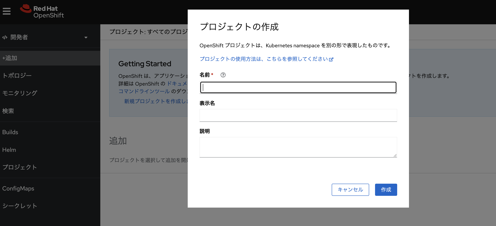

# :rocket: 01 - ワークショップのための環境をセットアップ

ワークショップに利用する Azure Red Hat OpenShift (ARO) 環境に接続します。ARO では、開発者が利用する操作の多くは OpenShift のコンソールから実施することができます

## ARO コンソールの URL に接続

ARO の OpenShift コンソールの URL を開き、コンソールのログイン画面を表示します

```
https://console-openshift-console.apps.<domain>.<region>.aroapp.io/
```

上記の domain および region は利用環境によって異なりますので確認してください

## コンソールにログイン

コンソールにログインします。ARO は Microsoft EntraID など、様々な認証プロバイダーと連携したユーザ認証を構成できます。このワークショップでは htpasswd 認証プロバイダーを利用してユーザ名とパスワードを用いたログインを利用します。参加者ごとに異なるユーザを利用しますので、確認してログインを実施してください


[(参考) Microsoft EntraID を用いた ARO の認証を構成する](https://learn.microsoft.com/ja-jp/azure/openshift/configure-azure-ad-ui)

## 開発者のコンソールでプロジェクトを作成

コンソールは管理者と開発者の２つの視点（パースペクティブ）があります。コンソールへ新規ユーザのログインが成功すると開発者のコンソールが開きます。左のサイドバーの上部が「開発者」と表示されていることを確認してください。もし「開発者」と表示されていない場合は、クリックして管理者から開発者への切り替えます


画面上に「新規プロジェクトを作成します」のリンクが表示されている場合は、クリックしてユーザ用のプロジェクトを作成します。もしログインしたユーザのプロジェクトが存在する場合は下図のような画面が表示されますので、新規にプロジェクトを作成するには画面上部のプロジェクト名の右側にある「▼」をクリックして表示された「プロジェクトの作成」を選択してください


プロジェクト名にはユーザー名など、他のユーザと重複しない名称を入力してください



プロジェクトを作成するとプロジェクトの初期画面が表示されます


## コマンドラインツールの利用

ARO の多くの操作はコンソールの UI から操作できますが、コマンドラインを用いた操作が便利な場合があります。ARO のコマンドラインツールとして OC コマンドラインツールを利用することができます(Kubernetes の標準クライアントツールである Kubectl を OpenShift 用に拡張したツール)。コマンドラインツールを利用する方法として、コンソールのターミナル機能を利用する方法と、クライアント環境にコマンドラインツールをインストールして利用する方法があります

### コンソールのターミナルを利用

コンソールの右上の「>_」アイコンをクリックすることで、コンソール組み込みのターミナルからコマンドラインツールを利用できます。コマンドラインツールのインストール等が不要で利用できますが、ターミナルとの接続が切断されるとコンテキスト（ファイルやコマンド履歴など）が失われてしまいますのでご注意ください。プロジェクトで初めてコンソールを開く際に「タイムアウト」をクリックすることで設定できますので、必要な時間に設定することをお勧めします


### クライアントにコマンドラインツールをインストール

コンソールの右上の「？」アイコンを選択して「コマンドラインツール」をクリックすると、各種環境向けのダウンロードリンク画面が表示されます。自分の環境に合ったものをダウンロードして利用してください


インストールしたコマンドラインツールから ARO に接続するためには認証用のトークンを取得する必要があります。コンソール左上のユーザ名を選択して「ログインコマンドのコピー」をクリックすることで、トークン情報が表示されます。表示されたトークンは１日ほどでタイムアウトしますのでご注意ください

### コマンドの実行

コマンドラインツールが利用可能となりましたら、下記のコマンドを実行して正しく動作しているか確認してください。うまくいけば、自分のプロジェクトの状態が表示されます

```bash
oc get project
```
---

➡️
次へ : [次のセクションへ](../02-deploy-from-catalog/README.md)
