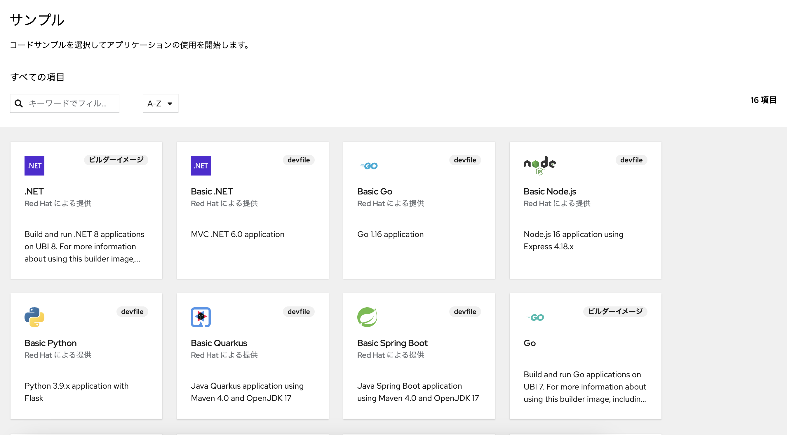

# :rocket: 02 - サンプルアプリのデプロイ

ARO では Red Hat社が提供するサンプルアプリや開発者カタログを用いてアプリを簡単にデプロイできます。このセクションでは、自分のプロジェクトにサンプルアプリをデプロイします

## プロジェクトへのアプリのデプロイ方法

コンソールのサイドバー左上部の「+追加」を選択すると、様々なアプリのデプロイ方法が表示されます。以下はコンソールからのアプリのデプロイ方法の一覧です

- **開発者カタログ**：Red Hat社が提供する様々なテンプレートやパッケージ（Operator および Helm チャート）から簡単にアプリをデプロイできます
- **Git リポジトリー**：GitHub などの Git リポジトリーのソースコードからコードをインポートしてアプリをデプロイします。Dockerfile などの準備は不要です
- **コンテナーイメージ**：すでにビルド済みのコンテナーイメージからアプリをデプロイできます。Azure Container Registry などのプライベートレジストリーからのデプロイも可能です
- **JAR ファイルのアップロード**：ローカルの JAR ファイルをアップロードしてデプロイできます
- **YAML のインポート**：YAML や JSON のマニフェスト定義からアプリやリソースをデプロイできます 
- **サンプル**：Red Hat社が提供するコードサンプルからデプロイできます

## サンプルアプリのデプロイ

画面右下の「サンプル」をクリックして、サンプルアプリのカタログを開きます。様々なサンプルが提供されています

ここでは Quarkus のサンプルアプリをデプロイしてみます。カタログから「Basic Quarkus」と書かれたサンプルアプリをクリックして、詳細画面を開いてください。入力されているパラメータは変更せず、画面下部の「作成」をクリックしてください

コンテナーがビルドされ、しばらくするとアプリがデプロイされます。コンソールの「トポロジー」の画面にアプリが表示され、クリックすると様々なアプリの状態を確認することができます

## サンプルアプリに接続

ARO では、Route と呼ばれるアプリの公開設定 (Ingress) を作成することで、ARO で稼働するアプリに対して URL を用いて接続することができます。サンプルアプリをデプロイすると、この Route が自動作成されます。トポロジー表示画面でデプロイしたサンプルアプリをクリックし、右下に表示される Route の URL を開くと、アプリに接続できます。次のような画面が表示されるはずです

---

➡️
次へ : [次のセクションへ](../03-deploy-spring-helloworld/README.md)
