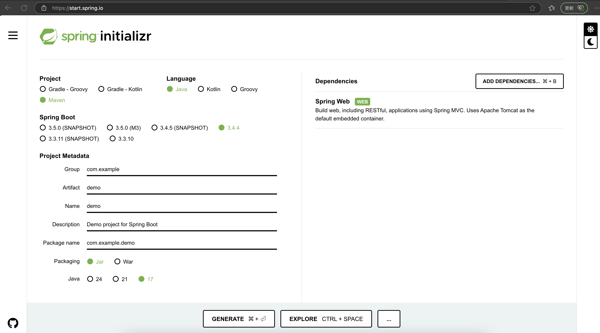
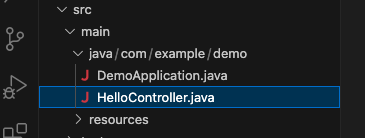
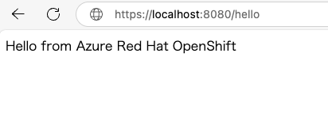
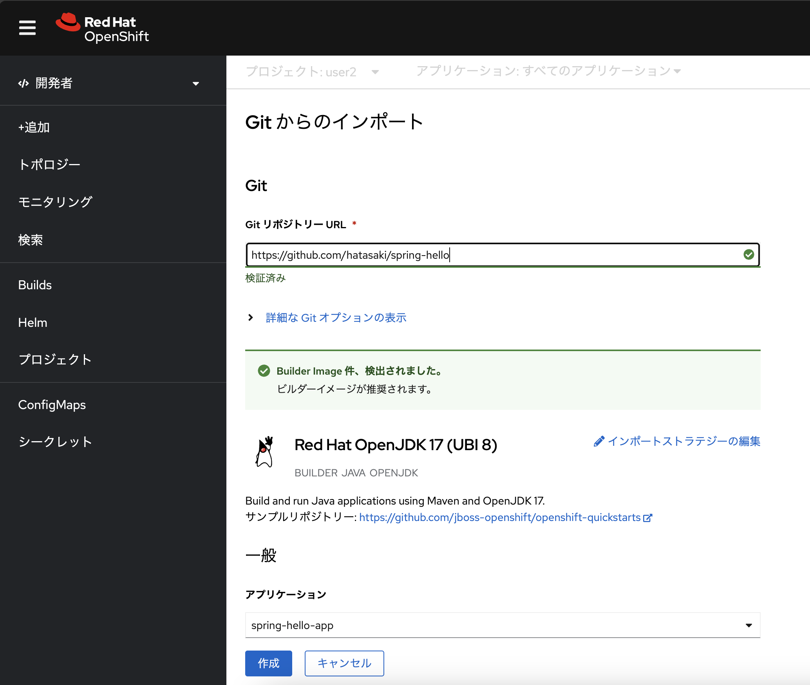
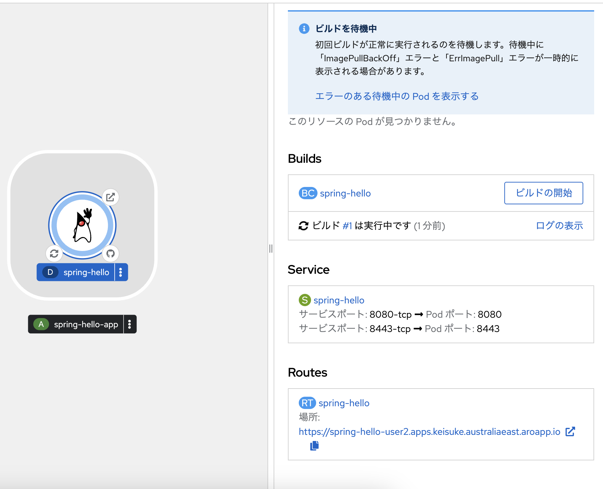
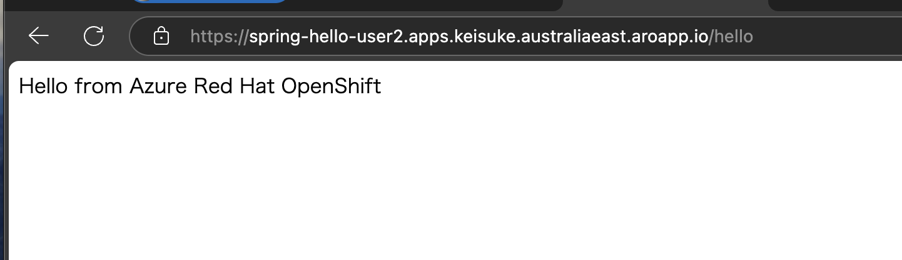

# :rocket: 03 - Hello World Spring Boot アプリを ARO にデプロイ

このセクションでは、Spring Boot の Hello World アプリを ARO にデプロイします。ソースコードを簡単に ARO にデプロイする方法はいくつかありますが、ここでは GitHub のレポジトリからインポートしてアプリをデプロイする方法を利用します
> このワークショップでは、参加者の GitHub レポジトリは利用せず、あらかじめ用意した Hello World アプリのレポジトリを利用します。以下に Hello World アプリの作成方法について説明します。もしご自身のレポジトリを利用したい場合はチャレンジしてみてください

## Spring Boot の `hello world` アプリの作成

Spring Boot アプリケーションを作成する一般的な方法は、Spring Initializer を使用することです。これは[https://start.spring.io/](https://start.spring.io/)から利用できます。下記の画面を参考に新しい Spring Boot プロジェクトを作成してください



コンソールのターミナルなどでコマンドラインを用いる場合、curl コマンドを利用して新しい Spring Boot プロジェクトを作成できます

```bash
mkdir helloworld
cd helloworld
curl https://start.spring.io/starter.tgz -d dependencies=web -d bootVersion=3.4.4 -d name=demo -d type=maven-project | tar -xzvf -
```

> このラボでは、Spring Bootのバージョンを3.4.4に固定し、`com.example.demo`パッケージを使用してデフォルト設定を維持します。

`src/main/java/com/example/demo`ディレクトリに移動し、`DemoApplication.java`ファイルと同じパッケージに`HelloController.java`という名前の新しいファイルを作成し、以下の内容を追加します：



```java
package com.example.demo;

import org.springframework.web.bind.annotation.GetMapping;
import org.springframework.web.bind.annotation.RestController;

@RestController
public class HelloController {

    @GetMapping("/hello")
    public String hello() {
        return "Hello from Azure Red Hat OpenShift\n";
    }
}
```

<details markdown="block">
<summary> (オプション) プロジェクトをローカルでテストする</summary>

ご利用のローカル環境が Java や maven などがセットアップ済みの場合、ローカルでコードをテストできます。以下のコマンドでプロジェクトをビルドして実行してください

```bash
./mvnw spring-boot:run
```

`/hello` エンドポイントにリクエストを送信すると、「Hello from Azure Red Hat OpenShift」というメッセージが返されるはずです。



</details>

## GitHub からのインポートで Hello world アプリをデプロイ

Hello world アプリの GitHub からのインポートを利用してデプロイします。上記の手順で作成した Hello world アプリと同様のソースコードが下記の GitHub レポジトリに保存されていますので、こちらを利用します

https://github.com/hatasaki/spring-hello

>自身の Git リポジトリを利用することも可能です。レポジトリを作成して上記の手順で作成したソースコードを push してください

ARO のコンソールに戻り、サイドメニューの「+追加」を選択して、「Git からのインポート」をクリックしてください。そして表示された画面の「Git リポジトリー URL」に上記のレポジトリの URL 入力します。レポジトリの中身の読み取りが実施され、内容に合わせた Builder イメージが選択されます（ここでは Red Hat OpenJDK 17 のイメージが選択されます）。画面下部の「作成」をクリックしてください



この操作により、GitHub リポジトリのソースコードを利用して自動的にアプリのビルドが開始されます。アプリのビルドが完了すると、アプリを実行するためのコンテナーイメージが作成されます。ビルドの様子はトポロジー画面で Hello world アプリを選択して Builds のログから確認できます 



ARO では内部用のコンテナーレジストリーを搭載しています。この手順でビルドされたアプリのコンテナーイメージは ARO 内部コンテナーレジストリーに保存されます。そして、そのコンテナーイメージを利用してアプリの Pod が起動します。アプリが起動したら、トポロジー画面で Hello world アプリを選択して Route に表示される URL に接続してください。パスに `/hello` の追加が必要な点に注意してください。下記の画面が表示されるはずです



---

➡️
次へ : [次のセクションへ](../04-monitoring-apps/README.md)
