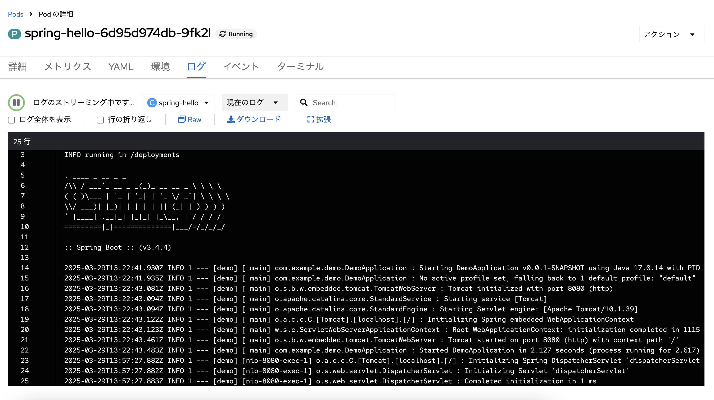
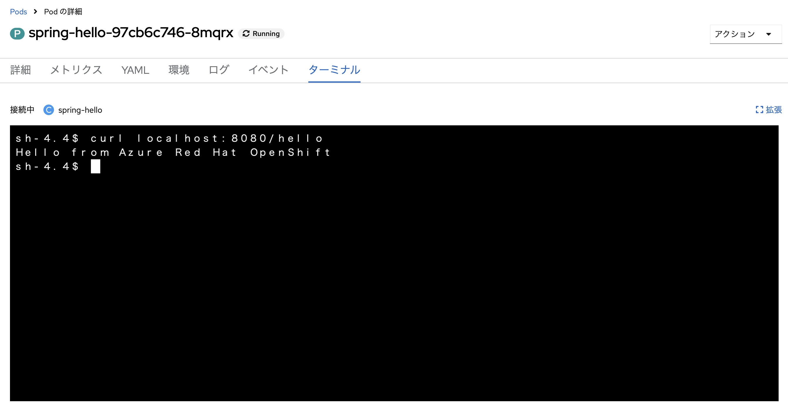
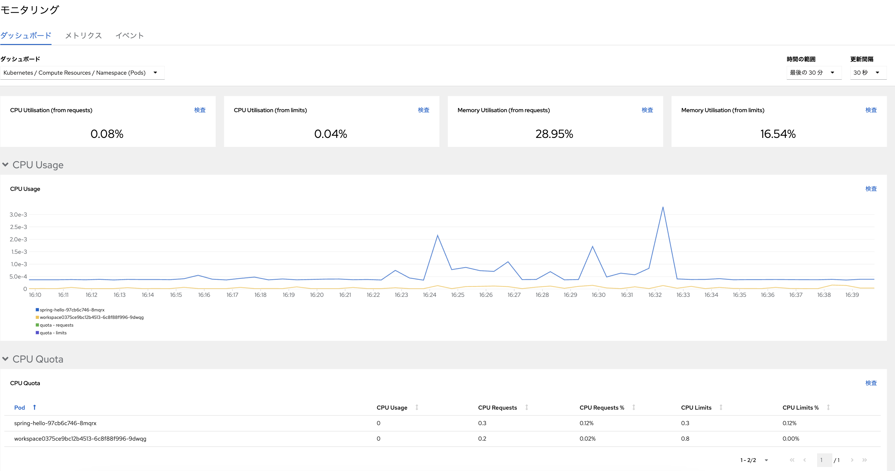
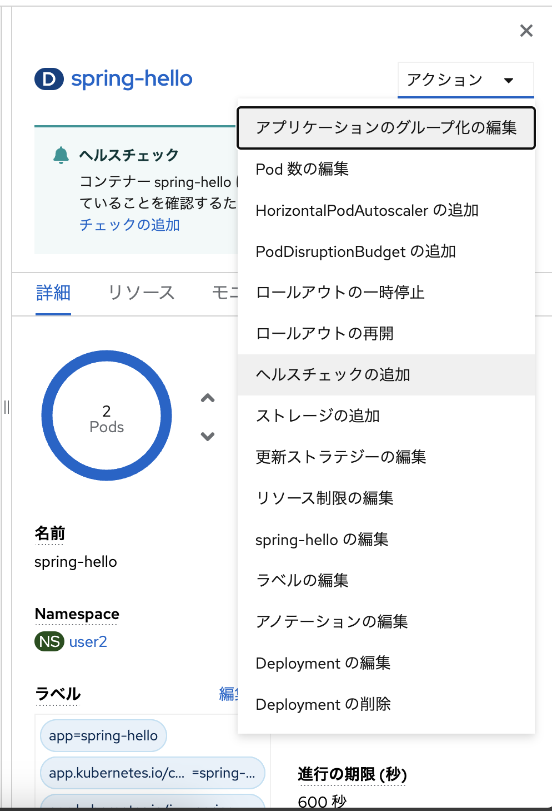
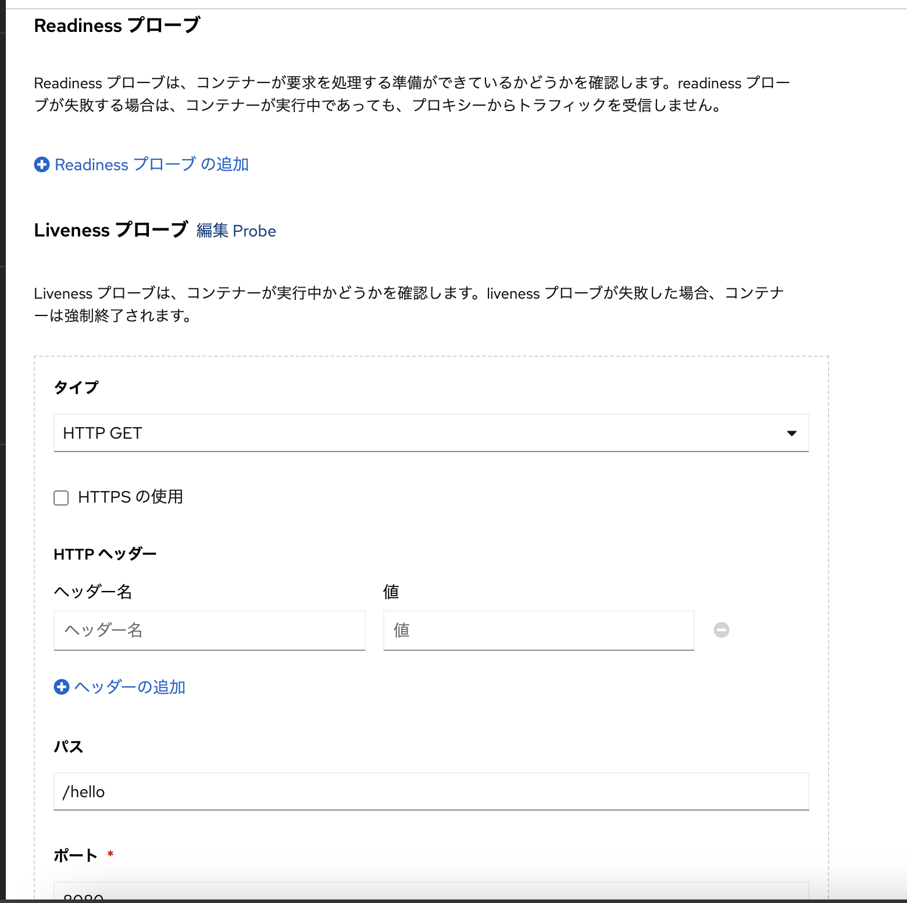

# :rocket: 04 - ARO でアプリの監視

アプリの健全な運用や管理には、監視機能の利用が不可欠です。ARO では、組み込みのログやメトリックの監視、正常性チェックなど利用してすぐに監視を始めることができます

## アプリのログ確認

トポロジー画面で Hello world アプリを選択し、Pods の「ログの表示」を選択すると、アプリのログを表示できます。標準出力や標準エラーなど、アプリから出力されるログ情報をリアルタイムに確認できます

## アプリのターミナル接続

構成の確認やテスト、デバッグなど、アプリのターミナルで直接操作を実施できれば便利です。ログ表示と同じ画面に表示されている「ターミナル」タブを選択すると、稼働しているアプリ Pod のターミナルに接続することができます

## アプリのメトリック確認

プロジェクトやアプリ Pod の CPU やメモリー、ネットワークなどのメトリックを確認し、リソースの利用状況や問題の発見などに役立てることができます。サイドメニューの「モニタリング」をクリックすると、プロジェクト全体や Pod のダッシュボードを開くことができます。また、PromQL をも良いてカスタムのメトリックを確認することも可能です

## ヘルスチェックの追加

アプリのヘルスチェックを追加し、レジリエントなアプリ運用を補助することができます。トポロジー画面で Hello world アプリを選択し、右上に表示される「アクション」プルダンメニューをクリックしてください。アプリに対して実施できる様々な操作が表示されます。ここでは「ヘルスチェックの追加」をクリックします

ヘルスチェックには次の３種類のプローブを設定できます

- **Readiness プローブ** : アプリが要求を処理可能か
- **Liveness プローブ** :　アプリが正常に実行されているか
- **Startup プローブ** :　アプリが正常に起動しているか

ここでは Liveness プローブに `/hello` エンドポイントの確認を追加します。下記の画面イメージのように Liveness プローブを追加し、「パス」に `/hello` を入力して、チェック「✔︎」を選択してプローブの内容を確定し。スクロールダウンして「保存」をクリックします。pod が再起動し、プローブが追加されます

## Azure Monitor Container Insights との連携

ARO では [Azure Monitor のコンテナー監視機能](https://learn.microsoft.com/en-us/azure/azure-monitor/containers/container-insights-overview)を有効化して監視することも可能です。これにより、Pod のログやメトリックを Azure 上で保持して分析したり、特定の条件でアラートを通知してアクションを実行することも可能です

---

➡️
次へ : [次のセクションへ](../05-scaling-apps/README.md)

