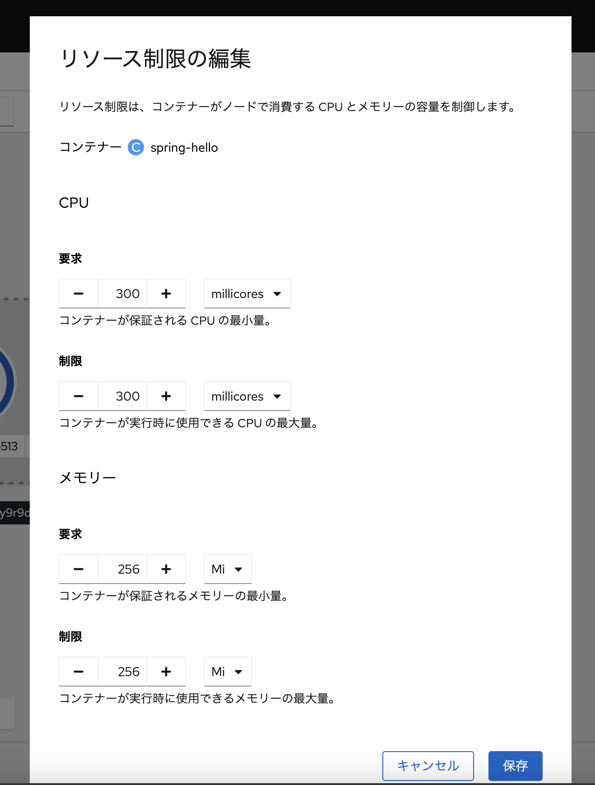

# :rocket: 05 - ARO でのアプリのスケーリング

アプリのスケーリングは、ユーザの要求に柔軟かつ効率的に対応するために欠かせない要素です。このセクションでは、ARO でのアプリの様々なスケーリングを構成します。構成するスケーリング方法は下記です

1. アプリの手動スケーリング
2. HPA (Horizontal Pod Autoscaler)
3. クラスターノードのスケーリング

## アプリの手動スケーリング

コンソールからアプリの Pod 数を手動で増加または削除することができます。ARO などの Kubernetes では、内部にロードバランサー機能を備えていますので、Pod 数を増加させると、自動的に負荷分散を実施してくれます。コンソールのトポロジー画面で、Hello world アプリを選択して表示される「詳細」タブをクリックしてください。下図のようにアプリの Pod に関する詳細情報が表示され、現在稼働中の Pod 数を確認できます。Pod 数を増やす上向きの矢印を 1 回クリックして Pod を追加してください。Pod が追加され、Pod が 2 つに増加するのを確認できます

## HPA (Horizontal Pod Autoscaler)

HPA（Horizontal Pod Autoscaler）は、CPU 使用率やメモリ使用率といった負荷の変動に応じて Pod の数を自動的に増減させる機能です。​これにより、システムの可用性を向上させ、コストを最適化できます。HPA を構成するためには、まずアプリに対してリソース制限を設定する必要があります。このリソース制限の値に基づいて、HPA は使用率を計算します

### リソース制限の設定

トポロジー画面で Hello world アプリを選択し、表示される右上の「アクション」プルダウンメニューから「リソース制限の編集」をクリックします。表示されるウインドウの CPU とメモリーの制限値をそれぞれ下図のように入力します。リソース制限は設定項目には「要求」と「制限」の２種類があります。「要求」は Pod をスケジュールする際に利用され、「制限」は実行時のリソース制御に利用されます
> リソース制限に極端な値を設定すると Pod が正常に起動できなかったり、必要以上のリソースが確保される場合がありますのでご注意ください

### HPA の構成

トポロジー画面に戻り、 Hello world アプリの「アクション」プルダウンメニューから「Horizontal Pod Autoscaler の追加」をクリックします。HPA の構成画面が表示されますので、下図のように CPU 使用率の値を入力して「保存」をクリックします。 HPA は Pod の平均使用率がこの値を上回ると Pod を自動追加します。トポロジー画面の Hello world アプリの「詳細」タブの表示が自動スケーリングに変わっていることが確認できます

## クラスターノードのスケーリング

ARO では様々な方法でアプリのスケーリングが可能ですが、インフラリソースが不足するとアプリはスケールできません。必要なインフラリソースをあらかじめ構成しておくことで対応できますが、コストとのバランスが重要になります。アプリに対する様々な要求に柔軟に応えるためには、インフラリソースも柔軟にスケールさせることが必要となります。ARO はクラウドのメリットを活かし、必要な時にアプリを稼働させるワーカーノードの追加や削減が可能です。ワーカーノードのスケーリング方法には、手動でのスケーリングと、Cluster Autoscaler と呼ばれるアプリの負荷に応じた自動スケーリングが可能です
> このセクションの操作にはクラスター管理者のロールが必要です。以下の操作は講師の操作画面にて実施します

### ワーカーノードの手動スケーリング

コンソールを「管理者向け表示」に切り替えると、様々な ARO クラスターに対する管理操作が可能です。クラスター管理者ロールを保持する管理者ユーザは、クラスターへのリソースの追加など、特権レベルの管理操作が可能です。管理者ポータルのサイドバーに表示される「コンピュート」セクションでは、クラスターのノード状態や設定が可能です。特にその中の MachineSets メニューでは、ワーカノードのスペックや台数を構成することができます。さらに、Spot VM や GPU など、要件に合わせた様々なノードの構成が可能です。MachineSets メニューを選択して表示される「必要なカウント」のマシン数をクリックすると、下記の画面のように手動でノード追加および削減が可能です

### Cluster Autoscaler による自動スケーリング

Cluster Autoscaler を構成すると、アプリの起動に必要なリソース不足を検知して、自動的にノードを追加することができます。もちろんリソースが不要となれば、自動的にノードは削減されます。これにより、アプリの要件に柔軟に対応しながらもコスト効率の高い運用が可能です。ARO で Cluster Autoscaler を利用するには、Cluster Autoscaler の定義と、MachineAutoscaler の 2 つを定義します

#### Cluster Autoscaler の定義

クラスター全体のスケーリング定義です。サイドバーの ClusterResourceDefinitions メニューから設定します。最大のノード数や、リソースの最大・最小値などを定義できます。AI アプリ向けに GPU リソースの考慮も可能です

#### MachineAutoscaler の定義

ノードの種類（スペックや配置する可用性ゾーンなど）毎のスケーリング定義です。サイドバーの MachineSets から作成することができます

---

➡️
次へ : [次のセクションへ](../06-attach-storage-to-app/README.md)
