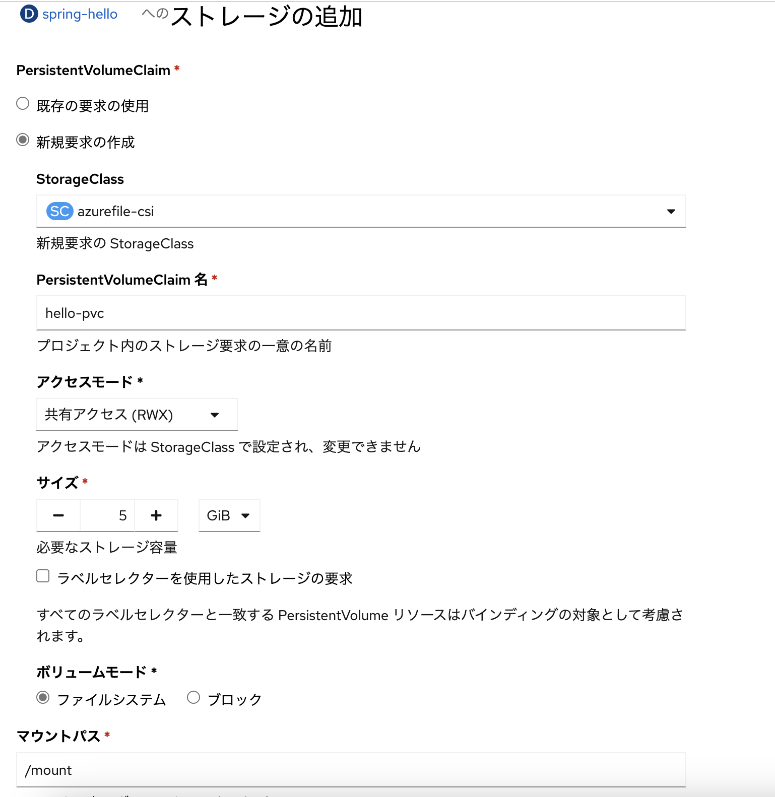
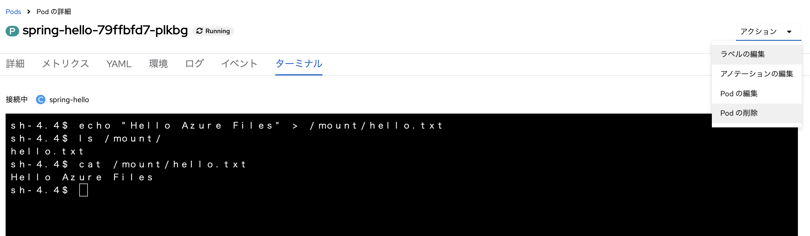
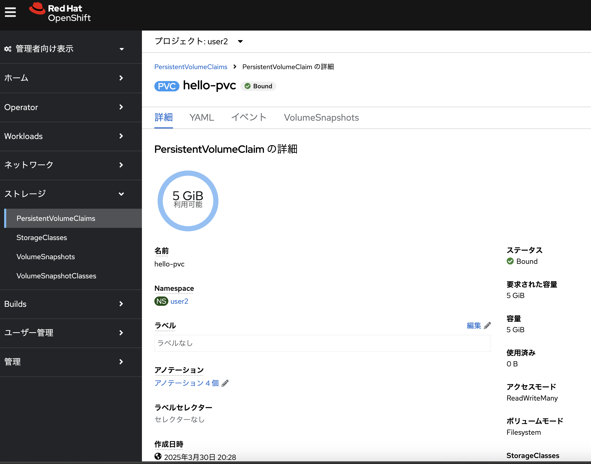
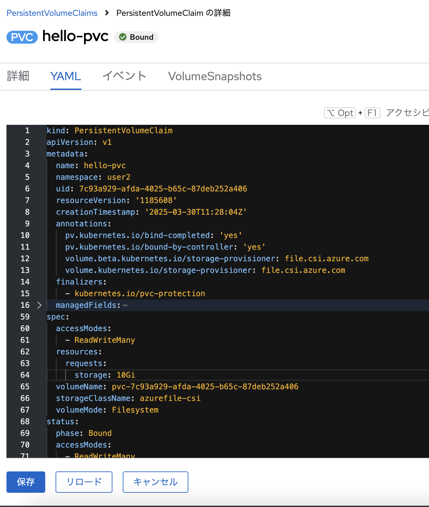
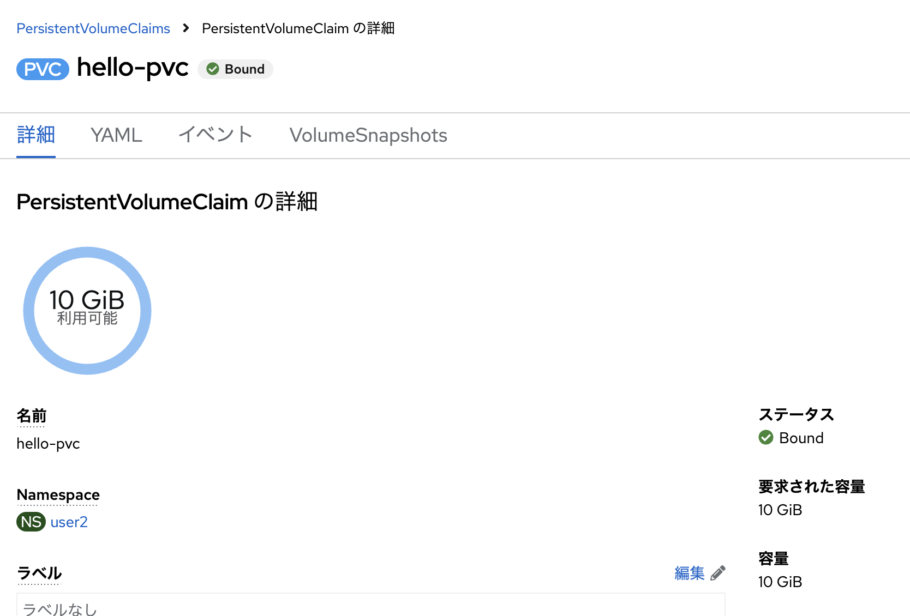

# :rocket: 06 - アプリに Azure のストレージをアタッチ

アプリのデータをストレージに保存するケースも多くあります。しかし、アプリの Pod のローカルファイルに保存しても、Pod の停止や再起動によりデータは失われます。ARO では永続ストレージ (Persistent Volume) として、Azure Disk や Azure Files などの様々なストレージを利用できます

## Hello World アプリに Azure FIles をアタッチ

コンソールのトポロジー画面で Hello world アプリを選択し、右上の「アクション」プルダウンメニューから「ストレージの追加」をクリックすることで、アプリ Pod にストレージを追加することができます。下図のように「ストレージの追加」画面が表示されますので、PersistentVolumeClaim（ストレージ要求）の`新規要求の作成`を選択し、StorageClass に`azurefile-csi`、PersistentVolumeClaim名に名称、アクセスモードは`RWX`、サイズに 5 GiB、マウントパスに`/mount`を入力し、「保存」をクリックしてください。この操作により、Azure 上で自動的に Azure Disk が作成されて、Pod が再起動してストレージがアタッチされた Pod が起動します



ARO ではデフォルトで下記の２種類の StorageClass が定義されています
- **managed-csi**: Azure Disk のボリュームを動的に作成して Pod に割り当てる定義
- **azurefile-csi**: Azure Files のファイルシェアを動的に作成して Pod に割り当てる定義

## Hello world アプリのターミナルに接続してファイルを作成

アプリにストレージがアタッチされていることを確認します。まずは Pod のターミナルに接続します。トポロジー画面で Hello world アプリを選択し、表示されたウインドウの「リソース」タブをクリックします。Pods に表示されている Pod の名前をクリックすると、Pod の詳細画面が表示されますので、「ターミナル」タブをクリックして Pod にターミナル接続してください。ストレージは`/mount`に接続されていますので、下記のコマンドを実行してファイルを作成します

``` bash
echo "Hello Azure Files" > /mount/hello.txt
```

ファイルが正常に作成されていることを確認したら、右上の「アクション」プルダウンメニューから「Pod の削除」をクリックし、Pod を強制的に再起動します



Pod の一覧画面が表示が表示されますので、新たに作成された Pod 名をクリックして、ターミナルに接続してください。`/mount`に作成したファイルが残っているはずです

# ストレージの動的拡張

ARO ではアタッチしたストレージの動的拡張が可能です。Pod のターミナルで`df`コマンドを実行すると、`/mount`に 5 GiB のストレージが接続されていることがわかります。次にポータルの左上のメニューで「管理者向け表示」に切り替えます。サイドメニューの「ストレージ」内にある「PersistentVolumeClaims」をクリックすると、ストレージ要求（PVC） の一覧が表示されます。今回アタッチした PVC を選択すると、下図のように PVC の詳細が表示されます



「YAML」タブをクリックして、表示されるマニフェスト定義の`storage: 5Gi`と書かれた箇所を探します。これを`storage: 10Gi`に変更し、「保存」をクリックします



「詳細」タブをクリックして再び PVC の詳細画面に戻ると、容量が 10 GiB に変わっているのが確認できます



再び「開発者」向けのコンソールに切り替えて、Hello world アプリの Pod のターミナルに接続してください。`df`コマンドの結果を確認すると、`/mount`の容量が 10 GiB に拡張されていることが確認できるはずです。さらに、`/mount`に保存したファイルも維持されていることが確認できます

## ストレージのその他の機能

「管理者向け表示」では、ストレージのスナップショットの作成も可能です。また、PVC を削除すれば、Azure 上のストレージも自動的に削除されます。このように、ARO では柔軟にアプリに必要なストレージの管理が可能です

---

➡️
次へ : [次のセクションへ](../07-deploy-ai-app/README.md)
